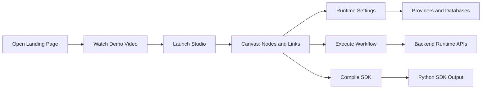
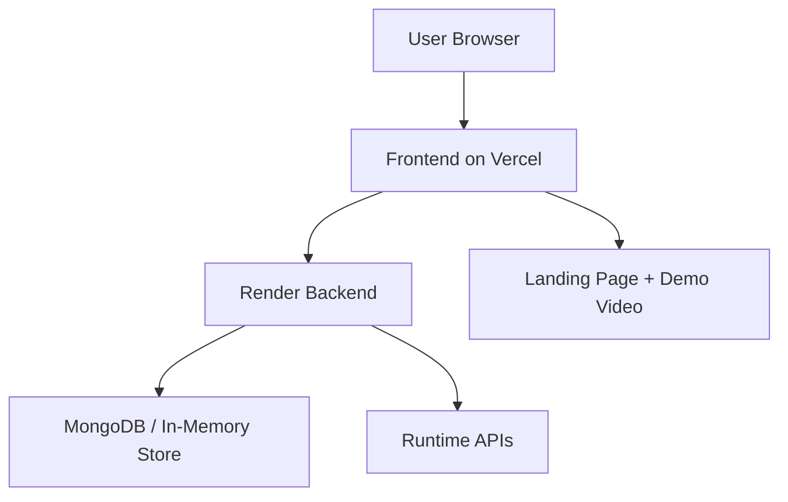

# PromptFlow Studio

<p align="center">
  
</p>

<p align="center">
  <a href="https://drive.google.com/file/d/15Ec6bOf10d5qD48JdaKLwjaeo9tIhqdG/preview"><strong>Watch the Demo Video</strong></a>
  · <a href="https://rakshitr.co.in">rakshitr.co.in</a>
  · <a href="https://promptflow.rakshitr.co.in">Live Demo</a>
  · <a href="#quick-start">Quick Start</a>
  · <a href="#how-it-works">How It Works</a>
  · <a href="#tech-stack">Tech Stack</a>
</p>

<p align="center">
  
  
  
  
</p>

---

## Overview

PromptFlow Studio is a visual AI workflow studio for designing prompt pipelines, connecting nodes, testing agent behavior, and compiling graphs into Python SDK-ready output.

It combines two experiences in one:

- A public landing page that introduces the product with a video-first hero.
- A working studio where you build and debug workflows in a node-based canvas.

The project is built to feel more like a futuristic product than a generic admin UI.

## Demo Video

The hero card above acts as the visual entry point.

Click here to open the hosted preview:

- [PromptFlow Studio Demo Video](https://drive.google.com/file/d/15Ec6bOf10d5qD48JdaKLwjaeo9tIhqdG/preview)

> GitHub README files do not reliably support embedded external video players, so the README uses a neon demo card that links to the hosted video preview.

## What It Does

- Builds prompt pipelines with connected nodes
- Supports templates and a blank canvas workflow
- Lets you configure providers and databases from runtime settings
- Runs workflow execution with feedback and issue detection
- Compiles graph logic into Python SDK-oriented output
- Uses a landing page to introduce the product before the studio opens

## How It Works



### Runtime flow

1. You land on the public home page.
2. You watch the demo or launch the studio.
3. You create a new workflow or load a template.
4. You connect nodes such as input, prompt, LLM, router, vector search, and output.
5. You configure providers and databases in Settings.
6. You run the workflow or compile it into SDK-style output.

## How To Use It

### 1. Open the app

- Local: run the frontend and backend together.
- Production: open the Vercel frontend and the Render backend.

### 2. Start a workflow

- Click `Launch Studio` from the home page.
- Choose a template if you want a fast starting point.
- Or begin with a blank graph if you want full control.

### 3. Configure runtime

- Add provider keys and model info in Settings.
- Configure vector databases if your graph uses RAG.
- Save the runtime so the studio can reuse it later.

### 4. Build and test

- Add nodes to the canvas.
- Connect outputs to inputs.
- Execute the graph and inspect the output.
- Fix warnings like missing provider, model, or database configuration.

### 5. Compile

- Use compile to turn the graph into Python SDK-oriented output.
- This bridges the visual workflow and implementation layer.

## Key Features

- Video-first landing page
- Futuristic home screen with a clear CTA
- Node-based workflow builder
- Template starter flows
- Runtime provider and database settings
- Graph validation and execution tracing
- SDK compilation workflow
- Local-first persistence with backend support

## Architecture



## Tech Stack

| Layer | Stack |
| --- | --- |
| Frontend | React, Vite, Lucide React |
| Backend | FastAPI, Python |
| Persistence | MongoDB, in-memory fallback |
| Deployment | Vercel, Render |
| UI Style | Custom CSS, glass panels, neon accents |

## Quick Start

### Frontend

```powershell
cd frontend
npm.cmd install
npm.cmd run dev
```

### Backend

```powershell
cd backend
python -m venv .venv
.venv\Scripts\activate
pip install -r requirements.txt
uvicorn app.main:app --reload
```

## Deployment Notes

- Deploy the frontend from the `frontend` app.
- Deploy the backend separately on Render.
- Set `VITE_API_BASE` in production so the frontend can reach the backend.
- The landing page is public, and the studio opens from the CTA or navbar Home tab.

## Project Layout

```text
frontend/
  src/
    App.jsx
    Home.jsx
    home.css
  public/
backend/
Docs/
```

## FAQ

### Why isn’t the video embedded inline?

GitHub README files do not reliably render external video iframes. The README uses a visual neon card that links to the hosted preview instead.

### What should I do first after opening the app?

Launch the studio, try a template, and then wire nodes together. The app is built to guide you from visual design to execution quickly.

### Are API keys stored in the workflow?

No. PromptFlow Studio uses a BYO runtime model so provider credentials live in Settings/runtime config, not in the saved graph.

## Author

Rakshit Rangarajan

- Website: [rakshitr.co.in](https://rakshitr.co.in)
- GitHub: [Rakshit-Rangarajan](https://github.com/Rakshit-Rangarajan)
- LinkedIn: [rakshit-rangarajan](https://www.linkedin.com/in/rakshit-rangarajan/)

